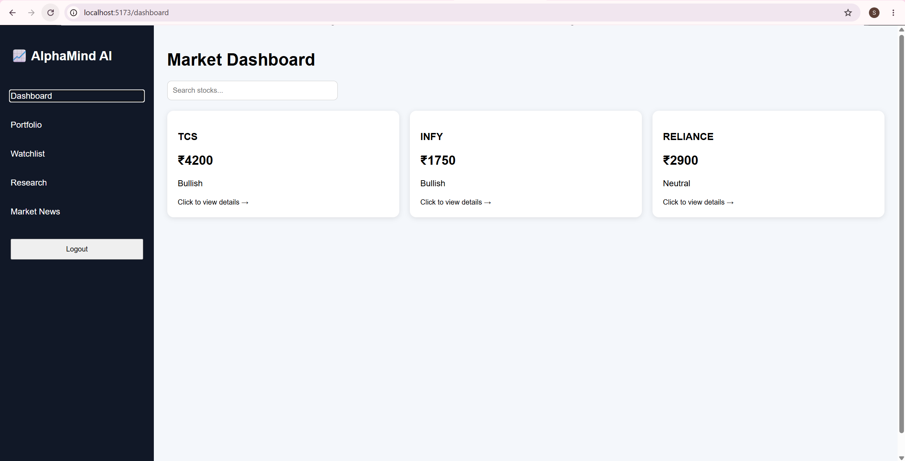
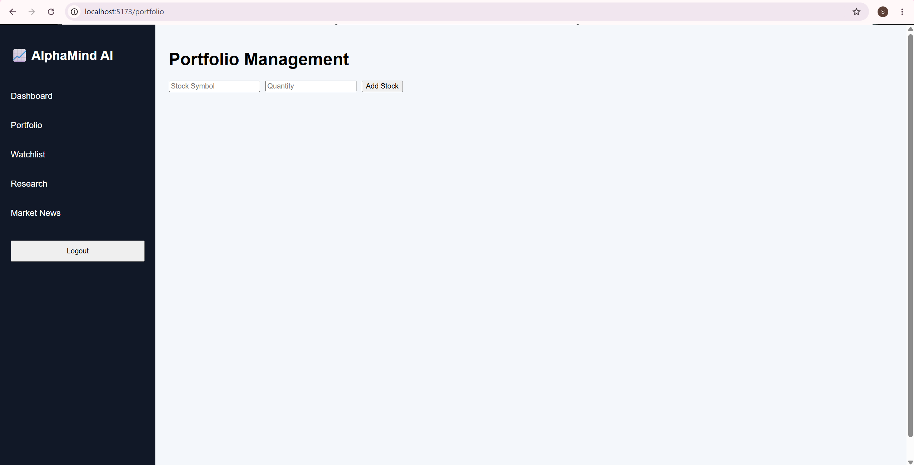
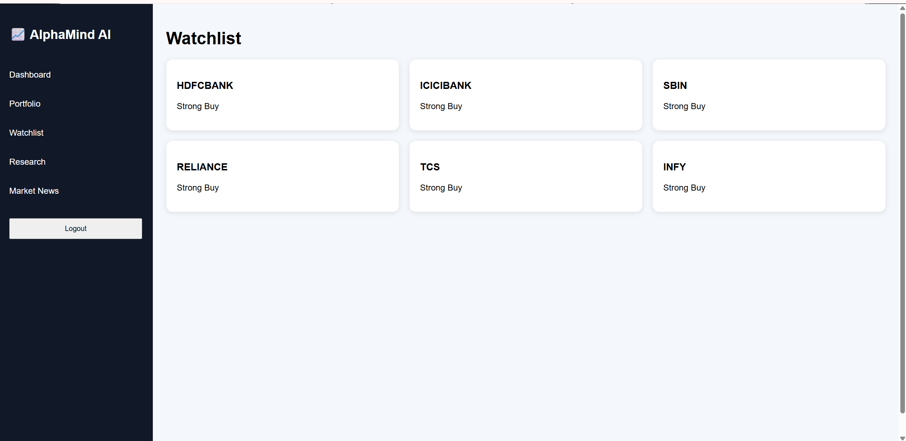

# AlphaMind AI 📈

AI-Powered Stock Market Research Platform

## Overview

AlphaMind AI is a full-stack stock market research and portfolio management platform built using React, TypeScript, Node.js, and Express. The application helps users analyze stocks, manage portfolios, track watchlists, and receive AI-powered research insights.

---

## Features

### Authentication

* User Registration
* User Login
* Local Storage Based Session Management
* Protected Routes
* Logout Functionality

### Dashboard

* Stock Market Overview
* Search Stocks
* Clickable Stock Cards
* Stock Insights

### Portfolio Management

* Add Stocks to Portfolio
* View Portfolio Holdings
* Delete Holdings
* Portfolio CRUD Operations

### Watchlist

* Track Favorite Stocks
* Quick Access to Stock Details

### Stock Details

* Company Symbol Information
* Current Price
* Market Sentiment
* AI Recommendation

### AI Research Assistant

* Analyze Stocks
* AI-Based Investment Insights
* Research Recommendations

### Market News

* Market Updates
* Stock Related News Feed

---

## Tech Stack

### Frontend

* React
* TypeScript
* React Router DOM
* Vite
* Axios

### Backend

* Node.js
* Express.js
* REST APIs
* CORS

### Authentication

* Local Storage Token Authentication

---

## Project Structure

alphamind-ai/

frontend/

* components/
* pages/
* routes/
* services/

backend/

* server.js

---

## API Endpoints

### Authentication

* POST /api/register
* POST /api/login

### Stocks

* GET /api/stocks
* GET /api/stocks/:symbol

### Research

* GET /api/analyze

### Portfolio

* GET /api/portfolio
* POST /api/portfolio
* DELETE /api/portfolio/:id

---

## Screenshots

### Dashboard



### Portfolio



### Watchlist



---

## Future Enhancements

* PostgreSQL Database Integration
* JWT Authentication
* Real-Time Stock Market Data
* AI Sentiment Analysis
* News Summarization
* Portfolio Risk Assessment
* Financial Report Analysis
* Predictive Analytics using Machine Learning

---

## Installation

### Frontend

```bash
cd frontend
npm install
npm run dev
```

### Backend

```bash
cd backend
npm install
node server.js
```

---

## Author

Sneha S

M.Tech Computer Science and engineering

Full Stack & AI Enthusiast
